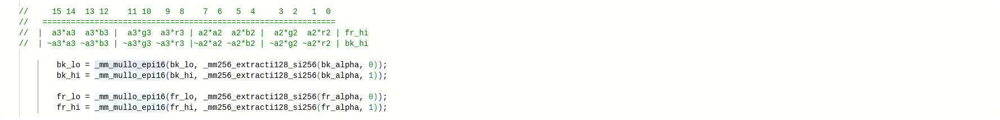
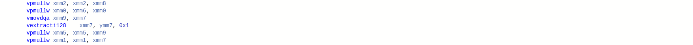

# Alpha blending

## Введение

Alpha blending - это процесс объединения изображения (foreground) с фоном (background) для создания видимости частичной или полной прозрачности. Результат объединения пикселя изображения и фона пересчитывается по следующей формуле:

$$X_{blend} = X_{fore} * A_{fore} + X_{back} * (1 - A_{fore})$$

, где $(RGBA) _ {fore},(RGBA) _ {back},(RGBA) _ {blend}$ - компоненты изображения, фона, блендинга соответственно.

Пример alpha-blending:


## Реализация

Для оптимизации пересчета цветов пикселей можно использовать SIMD инструкции. В данной работе представлено 2 версии пересчета с использованием векторизации и одна скалярная реализация.

Для поиска среднего времени выполнения цикла пересчета, он отдельной программой запускался `10000` для векторных реализаций и `5000` раз  для скалярной при размерах `1000*1000` изображения и фона.

Как запустить тестирование:

OS Linux:

```
cd src
make timer
./time                      // run all versions
./time --intrin --improved  // run only simd versions
./time --help               // show manual
```
Настройки (кол-во тестов для усреднения, размеры изображений и фона и т.д.) в src/settings.h

Среда тестирования:

| CPU                   | Compiler   | OS                     |
|-----------------------|------------|------------------------|
| AMD Ryzen 7 PRO 5850U | GCC 11.3.0 | Linux Mint 21 Cinnamon |

Флаги сборки:

```
-O3 -mavx2
```

Результаты тестирования:

| Версия   | Время, мс     | Коэффициент ускорения относительно предыдущей версии | Коэффициент ускорения относительно начальной версии |
|----------|---------------|------------------------------------------------------|-----------------------------------------------------|
| simple   | 10.54 +- 0.06 | 1.00 (начальная версия)                              | 1.00 (начальная версия)                             |
| intrin   | _1.36 +- 0.01 | 7.75 +- 0.10                                         | 7.75 +- 0.10                                        |
| improved | _1.26 +- 0.01 | 1.08 +- 0.01                                         | 8.37 +- 0.11                                        |

Описание версий (исходный код версий в src/alpha_blending.cpp):

`simple` - в теле цикла пересчета цвета обрабатывается один пиксель

`intrin`   - независимая обработка четырех пикселей в теле цикла, вычисления по формуле $X_{blend} = X_{fore} * A_{fore} + X_{back} * (1 - A_{fore})$

`improved` - независимая обработка четырех пикселей в теле цикла, вычисления по формуле $X_{blend} = (X_{fore} - X_{back}) * A_{fore} + X_{back}$

## Анализ

### [***intrin***](https://godbolt.org/z/v36boc7ov) & [***improved***](https://godbolt.org/z/5Wz75EGn1)

`intrin` и `improved` версии обрабатывают 4 пикселя за инструкцию с помощью `xmm` и `ymm` регистров. `improved` немного быстрее, так как формула пересчета использует одну операцию умножения вместо четырех в `intrin` версии.

intrin:



improved:


`simple`, помимо пересчета каждого пикселя по формуле выше, в добавок делает битовые сдвиги для извлечения и загрузки компонент в 32-битное целое и много операций обращения к памяти. Поэтому ускорение больше, чем в 4 раза.
